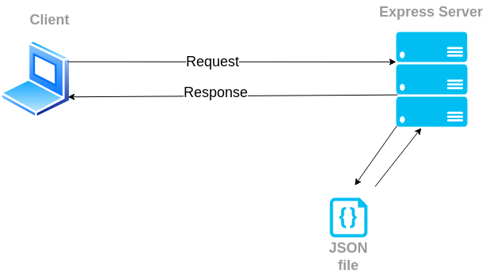

# Responder

## Description

REST API for simple questions and answers submissions.

## Table of content

- [Techstack](#techstack)
- [Preqrequisities](#preqrequisities)
- [Run API](#to-run-api)
- [Postman collection](#postman-collection)
- [Architecture](#architecture)
- [API endpoints](#api-endpoints)
- [Middleware](#repositories-middleware)
- [Tests](#tests)
  - [To run](#to-run)
  - [Get questions](#get-questions)
  - [Get question by id](#get-question-by-id)
  - [Create question](#create-question)
  - [Get answers](#get-answers-of-specific-question)
  - [Get answer](#get-answer-by-id)
  - [Create answer](#create-answer)

## Techstack

- `Javascript`
- `Express.js`
- `Jest`

## Prerequisities

- installed `node.js` in `16.x` version.

## To run API

### Clone repository

```
git clone https://github.com/wojciechszmelczerczyk/frompolandwithdev-recruitement-task.git
```

### Navigate to project folder

```sh
cd /frompolandwithdev-recruitement-task
```

### Install dependencies

```
npm i
```

### Run API

```
npm run start
```

## Postman collection

Additional Postman collection file

[Postman file](./frompoland-backend-task.postman_collection.json)

## Architecture

App implements REST API architecture style. Client communicate with Express Server.

Data is being saved to JSON file.

<details>
<summary>App architecture</summary>


</details>

## API endpoints

| Method | Endpoint                                                              |
| :----: | :-------------------------------------------------------------------- |
|  GET   | [`/questions`](./docs/getQuestions.md)                                |
|  POST  | [`/questions`](./docs/post-question.md)                               |
|  GET   | [`/questions/:questionId`](./docs/getQuestionById.md)                 |
|  GET   | [`/questions/:questionId/answers`](./docs/getAnswers.md)              |
|  POST  | [`/questions/:questionId/answers`](./docs/post-answer.md)             |
|  GET   | [`/questions/:questionId/answers/:answerId`](./docs/getAnswerById.md) |

## Tests

### To run

```
npm run test
```

### Get questions

`GET /questions`

<details>
<summary>when questions list length is equal to 0</summary>

```javascript
test('should return a list of 0 questions', async () => {
  expect(await questionRepo.getQuestions()).toHaveLength(0)
})
```

</details>

<details>
<summary>when questions list length is equal to 2</summary>

```javascript
test('should return a list of 2 questions', async () => {
  const testQuestions = [
    {
      id: faker.datatype.uuid(),
      summary: 'What is my name?',
      author: 'Jack London',
      answers: []
    },
    {
      id: faker.datatype.uuid(),
      summary: 'Who are you?',
      author: 'Tim Doods',
      answers: []
    }
  ]

  await writeFile(TEST_QUESTIONS_FILE_PATH, JSON.stringify(testQuestions))

  expect(await questionRepo.getQuestions()).toHaveLength(2)
})
```

</details>

### Get question by id

`GET /questions/:questionId`

<details>
<summary>when id match uuidv4 regex, return question by specific id</summary>

```javascript
test('when id match uuidv4 regex, return question by specific id', async () => {
  // user id
  let id = faker.datatype.uuid()

  const testQuestions = [
    {
      id,
      summary: 'What is my name?',
      author: 'Jack London',
      answers: []
    },
    {
      id: faker.datatype.uuid(),
      summary: 'Who are you?',
      author: 'Tim Doods',
      answers: []
    }
  ]

  await writeFile(TEST_QUESTIONS_FILE_PATH, JSON.stringify(testQuestions))

  const question = await questionRepo.getQuestionById(id)

  expect(question).toStrictEqual(testQuestions[0])
})
```

</details>

<details>
<summary>when question with such id doesn't exist, return error message</summary>

```javascript
test("when question with such id doesn't exist, return error message", async () => {
  // some random uuidv4
  let id = '9f27029e-02da-4df1-b5f2-011c1bec5abd'

  const testQuestions = [
    {
      id: faker.datatype.uuid(),
      summary: 'What is my name?',
      author: 'Jack London',
      answers: []
    },
    {
      id: faker.datatype.uuid(),
      summary: 'Who are you?',
      author: 'Tim Doods',
      answers: []
    }
  ]

  await writeFile(TEST_QUESTIONS_FILE_PATH, JSON.stringify(testQuestions))

  const res = await questionRepo.getQuestionById(id)

  expect(res['err']).toBe("question with this id doesn't exist")
})
```

</details>

<details>
<summary>when id doesn't match uuidv4 regex, return error message</summary>

```javascript
test("when id doesn't match uuidv4 regex, return error message", async () => {
  // incorrect user id sample
  let id = '123'

  const testQuestions = [
    {
      id,
      summary: 'What is my name?',
      author: 'Jack London',
      answers: []
    },
    {
      id: faker.datatype.uuid(),
      summary: 'Who are you?',
      author: 'Tim Doods',
      answers: []
    }
  ]

  await writeFile(TEST_QUESTIONS_FILE_PATH, JSON.stringify(testQuestions))

  const res = await questionRepo.getQuestionById(id)

  expect(res['err']).toBe("id doesn't match uuidv4 pattern")
})
```

</details>

### Create question

`POST /questions`

<details>
<summary>when question datatype is correct add new question</summary>

```javascript
test('when question datatype is correct add new question', async () => {
  // questions list
  const testQuestions = [
    {
      id: faker.datatype.uuid(),
      summary: 'What is my name?',
      author: 'Jack London',
      answers: []
    },
    {
      id: faker.datatype.uuid(),
      summary: 'Who are you?',
      author: 'Tim Doods',
      answers: []
    }
  ]

  // questions list length
  let questionsListLength = testQuestions.length

  // new question
  const newQuestion = {
    id: faker.datatype.uuid(),
    summary: 'How fast sound travel?',
    author: 'Norman Kowalsky',
    answers: []
  }

  // write base 2 questions to file
  await writeFile(TEST_QUESTIONS_FILE_PATH, JSON.stringify(testQuestions))

  // add new question
  await questionRepo.addQuestion(newQuestion)

  // read question list from file with new question added and parse to object
  let listWithNewQuestion = JSON.parse(
    await readFile(TEST_QUESTIONS_FILE_PATH, {
      encoding: 'utf-8'
    })
  )

  // expect new list length to be greater by 1 (new question added)
  expect(listWithNewQuestion.length).toBe(questionsListLength + 1)
})
```

</details>

<details>
<summary>when question datatype is incorrect, return error message</summary>

```javascript
test('when question datatype is incorrect, return error message', async () => {
  // questions list
  const testQuestions = [
    {
      id: faker.datatype.uuid(),
      summary: 'What is my name?',
      author: 'Jack London',
      answers: []
    },
    {
      id: faker.datatype.uuid(),
      summary: 'Who are you?',
      author: 'Tim Doods',
      answers: []
    }
  ]

  // new question
  const newQuestion = {
    id: faker.datatype.uuid(),
    summary: 5,
    author: 123,
    answers: []
  }

  // write base 2 questions to file
  await writeFile(TEST_QUESTIONS_FILE_PATH, JSON.stringify(testQuestions))

  // return error message
  const res = await questionRepo.addQuestion(newQuestion)

  // expect error message, new question has not been added due to summary field incorrect datatype
  expect(res['err']).toBe(
    'Inappropriate question provided. Author and title has to be string value'
  )
})
```

</details>

<details>
<summary>when question with provided title already exist, return error message</summary>

```javascript
test('when question with provided title already exist, return error message', async () => {
  // questions list
  const testQuestions = [
    {
      id: faker.datatype.uuid(),
      summary: 'What is my name?',
      author: 'Jack London',
      answers: []
    },
    {
      id: faker.datatype.uuid(),
      summary: 'Who are you?',
      author: 'Tim Doods',
      answers: []
    }
  ]

  // new question
  const duplicateQuestion = {
    id: faker.datatype.uuid(),
    summary: 'What is my name?',
    author: 'Wojciech Nowak',
    answers: []
  }

  // write base 2 questions to file
  await writeFile(TEST_QUESTIONS_FILE_PATH, JSON.stringify(testQuestions))

  // return error message
  const res = await questionRepo.addQuestion(duplicateQuestion)

  // expect error message, new question has not been added due to question duplicate
  expect(res['err']).toBe('This question already exist')
})
```

</details>

### Get answers of specific question

`GET /questions/:questionId/answers`

<details>
<summary>when id match uuid regex return answers of specific question</summary>

```javascript
test('when id match uuid regex return answers of specific question', async () => {
  // user id
  let id = faker.datatype.uuid()

  // sample questions
  const testQuestions = [
    {
      id,
      summary: 'What is my name?',
      author: 'Jack London',
      answers: []
    },
    {
      id: faker.datatype.uuid(),
      summary: 'Who are you?',
      author: 'Tim Doods',
      answers: []
    }
  ]

  // write questions to file
  await writeFile(TEST_QUESTIONS_FILE_PATH, JSON.stringify(testQuestions))

  // new answer object
  const newAnswer = {
    id: faker.datatype.uuid(),
    summary: 'test',
    author: 'Andrew Dude'
  }

  // add new answer
  await questionRepo.addAnswer(id, newAnswer)

  // get answers
  const [answers] = await questionRepo.getAnswers(id)

  expect(answers['summary']).toBe(newAnswer.summary)
})
```

</details>

<details>
<summary>when question with provided id doesn't exist, return error message</summary>

```javascript
test("when question with provided id doesn't exist, return error message", async () => {
  // some random uuidv4
  let id = '9f27029e-02da-4df1-b5f2-011c1bec5abd'

  // sample questions
  const testQuestions = [
    {
      id: faker.datatype.uuid(),
      summary: 'What is my name?',
      author: 'Jack London',
      answers: []
    },
    {
      id: faker.datatype.uuid(),
      summary: 'Who are you?',
      author: 'Tim Doods',
      answers: []
    }
  ]

  // write questions to file
  await writeFile(TEST_QUESTIONS_FILE_PATH, JSON.stringify(testQuestions))

  // get error response
  const res = await questionRepo.getAnswers(id)

  expect(res['err']).toBe("question with such id doesn't exist")
})
```

</details>

<details>
<summary>when id doesn't match uuidv4 regex</summary>

```javascript
test("when id doesn't match uuidv4 regex", async () => {
  // user id
  let id = 'someString'

  // sample questions
  const testQuestions = [
    {
      id,
      summary: 'What is my name?',
      author: 'Jack London',
      answers: []
    },
    {
      id: faker.datatype.uuid(),
      summary: 'Who are you?',
      author: 'Tim Doods',
      answers: []
    }
  ]

  // write questions to file
  await writeFile(TEST_QUESTIONS_FILE_PATH, JSON.stringify(testQuestions))

  const res = await questionRepo.getAnswers(id)

  expect(res['err']).toBe("id doesn't match uuidv4 pattern")
})
```

</details>

### Get answer by id

`GET /questions/:questionId/answers/:answerId`

<details>
<summary>when question and answer id's are correct return single answer</summary>

```javascript
test("when question and answer id's are correct return single answer", async () => {
  // user id
  let questionId = faker.datatype.uuid()
  let answerId = faker.datatype.uuid()

  // sample questions
  const testQuestions = [
    {
      id: questionId,
      summary: 'What is my name?',
      author: 'Jack London',
      answers: []
    },
    {
      id: faker.datatype.uuid(),
      summary: 'Who are you?',
      author: 'Tim Doods',
      answers: []
    }
  ]

  // write questions to file
  await writeFile(TEST_QUESTIONS_FILE_PATH, JSON.stringify(testQuestions))

  // new answer objects
  const firstAnswer = {
    id: answerId,
    summary: 'test',
    author: 'Andrew Dude'
  }

  const secondAnswer = {
    id: faker.datatype.uuid(),
    summary: 'test2',
    author: 'Michael Bay'
  }

  // add new answers
  await questionRepo.addAnswer(questionId, firstAnswer)
  await questionRepo.addAnswer(questionId, secondAnswer)

  // get single answer
  const singleAnswer = await questionRepo.getAnswer(questionId, answerId)

  expect(singleAnswer['summary']).toBe(firstAnswer.summary)
})
```

</details>

<details>
<summary>when question and answer id's doesn't match uuidv4 regex, return error message</summary>

```javascript
test("when question and answer id's doesn't match uuidv4 regex, return error message", async () => {
  // user id
  let questionId = 'someString'
  let answerId = 'someString'

  // sample questions
  const testQuestions = [
    {
      id: questionId,
      summary: 'What is my name?',
      author: 'Jack London',
      answers: []
    },
    {
      id: faker.datatype.uuid(),
      summary: 'Who are you?',
      author: 'Tim Doods',
      answers: []
    }
  ]

  // write questions to file
  await writeFile(TEST_QUESTIONS_FILE_PATH, JSON.stringify(testQuestions))

  // new answer objects
  const firstAnswer = {
    id: answerId,
    summary: 'test',
    author: 'Andrew Dude'
  }

  const secondAnswer = {
    id: faker.datatype.uuid(),
    summary: 'test2',
    author: 'Michael Bay'
  }

  // add new answers
  await questionRepo.addAnswer(questionId, firstAnswer)
  await questionRepo.addAnswer(questionId, secondAnswer)

  // get single answer
  const res = await questionRepo.getAnswer(questionId, answerId)

  expect(res['err']).toBe("Provided id's have doesn't match uuidv4 pattern")
})
```

</details>

<details>
<summary>when question with provided id doesn't exist, return error message</summary>

```javascript
test("when question with provided id doesn't exist, return error message", async () => {
  let questionId = '66ce665a-4b22-4d57-9662-7daeeece4e72'
  let answerId = faker.datatype.uuid()

  // sample questions
  const testQuestions = [
    {
      id: faker.datatype.uuid(),
      summary: 'What is my name?',
      author: 'Jack London',
      answers: []
    },
    {
      id: faker.datatype.uuid(),
      summary: 'Who are you?',
      author: 'Tim Doods',
      answers: []
    }
  ]

  // write questions to file
  await writeFile(TEST_QUESTIONS_FILE_PATH, JSON.stringify(testQuestions))

  // new answer objects
  const firstAnswer = {
    id: answerId,
    summary: 'test',
    author: 'Andrew Dude'
  }

  const secondAnswer = {
    id: faker.datatype.uuid(),
    summary: 'test2',
    author: 'Michael Bay'
  }

  // add new answers
  await questionRepo.addAnswer(questionId, firstAnswer)
  await questionRepo.addAnswer(questionId, secondAnswer)

  // get single answer
  const res = await questionRepo.getAnswer(questionId, answerId)

  expect(res['err']).toBe("question with such id doesn't exist")
})
```

</details>

<details>
<summary>when answer with provided id doesn't exist, return error message</summary>

```javascript
test("when answer with provided id doesn't exist, return error message", async () => {
  let questionId = faker.datatype.uuid()
  let answerId = 'fd0f5cc2-fe49-40f6-b1eb-ad9edf32fca9'

  // sample questions
  const testQuestions = [
    {
      id: questionId,
      summary: 'What is my name?',
      author: 'Jack London',
      answers: []
    },
    {
      id: faker.datatype.uuid(),
      summary: 'Who are you?',
      author: 'Tim Doods',
      answers: []
    }
  ]

  // write questions to file
  await writeFile(TEST_QUESTIONS_FILE_PATH, JSON.stringify(testQuestions))

  // new answer objects
  const firstAnswer = {
    id: faker.datatype.uuid(),
    summary: 'test',
    author: 'Andrew Dude'
  }

  // add new answer
  await questionRepo.addAnswer(questionId, firstAnswer)

  // get single answer
  const res = await questionRepo.getAnswer(questionId, answerId)

  expect(res['err']).toBe("answer with such id doesn't exist")
})
```

</details>

### Create answer

`POST /questions/:questionId/answers`

<details>
<summary>when question id and answer are correct, return question with new answer</summary>

```javascript
test('when question id and answer are correct, return question with new answer', async () => {
  // question id
  let questionId = faker.datatype.uuid()

  // sample questions
  const testQuestions = [
    {
      id: questionId,
      summary: 'What is my name?',
      author: 'Jack London',
      answers: []
    },
    {
      id: faker.datatype.uuid(),
      summary: 'Who are you?',
      author: 'Tim Doods',
      answers: []
    }
  ]

  // new answer object
  const newAnswer = {
    id: faker.datatype.uuid(),
    summary: 'test',
    author: 'Andrew Dude'
  }

  // write questions to file
  await writeFile(TEST_QUESTIONS_FILE_PATH, JSON.stringify(testQuestions))

  const questionWithNewAnswer = await questionRepo.addAnswer(
    questionId,
    newAnswer
  )

  expect(questionWithNewAnswer['answers'][0]['summary']).toBe(newAnswer.summary)
})
```

</details>

<details>
<summary>when provided id doesn't match uuidv4 regex, return error message</summary>

```javascript
test("when provided id doesn't match uuidv4 regex, return error message", async () => {
  // question id
  let questionId = '123'

  // sample questions
  const testQuestions = [
    {
      id: questionId,
      summary: 'What is my name?',
      author: 'Jack London',
      answers: []
    },
    {
      id: faker.datatype.uuid(),
      summary: 'Who are you?',
      author: 'Tim Doods',
      answers: []
    }
  ]

  // new answer object
  const newAnswer = {
    id: faker.datatype.uuid(),
    summary: 'test',
    author: 'Andrew Dude'
  }

  // write questions to file
  await writeFile(TEST_QUESTIONS_FILE_PATH, JSON.stringify(testQuestions))

  const res = await questionRepo.addAnswer(questionId, newAnswer)

  expect(res['err']).toBe("id doesn't match uuidv4 pattern")
})
```

</details>

<details>
<summary>when answer object fields are not string type, return error message</summary>

```javascript
test('when answer object fields are not string type, return error message', async () => {
  // question id
  let questionId = faker.datatype.uuid()

  // sample questions
  const testQuestions = [
    {
      id: questionId,
      summary: 'What is my name?',
      author: 'Jack London',
      answers: []
    },
    {
      id: faker.datatype.uuid(),
      summary: 'Who are you?',
      author: 'Tim Doods',
      answers: []
    }
  ]

  // new answer object
  const newAnswer = {
    id: faker.datatype.uuid(),
    summary: 123,
    author: 123
  }

  // write questions to file
  await writeFile(TEST_QUESTIONS_FILE_PATH, JSON.stringify(testQuestions))

  const res = await questionRepo.addAnswer(questionId, newAnswer)

  expect(res['err']).toBe(
    'Author and title of question have to be string value'
  )
})
```

</details>

<details>
<summary>when question with provided id doesn't exist, return error message</summary>

```javascript
test("when question with provided id doesn't exist, return error message", async () => {
  // question id
  let questionId = 'acda9bed-d5f0-4a8e-a92c-f44642640dac'

  // sample questions
  const testQuestions = [
    {
      id: faker.datatype.uuid(),
      summary: 'What is my name?',
      author: 'Jack London',
      answers: []
    },
    {
      id: faker.datatype.uuid(),
      summary: 'Who are you?',
      author: 'Tim Doods',
      answers: []
    }
  ]

  // new answer object
  const newAnswer = {
    id: faker.datatype.uuid(),
    summary: 'some dummy answer',
    author: 'John Nash'
  }

  // write questions to file
  await writeFile(TEST_QUESTIONS_FILE_PATH, JSON.stringify(testQuestions))

  const res = await questionRepo.addAnswer(questionId, newAnswer)

  expect(res['err']).toBe("question with this id doesn't exist")
})
```

</details>

<details>
<summary>when user submit answer for same question more than once, return error</summary>

```javascript
test('when user submit answer for same question more than once, return error', async () => {
  // question id
  let questionId = faker.datatype.uuid()

  // sample questions
  const testQuestions = [
    {
      id: questionId,
      summary: 'What is my name?',
      author: 'Jack London',
      answers: [
        {
          id: faker.datatype.uuid(),
          summary: 'George!',
          author: 'John Nash'
        }
      ]
    },
    {
      id: faker.datatype.uuid(),
      summary: 'Who are you?',
      author: 'Tim Doods',
      answers: []
    }
  ]

  // answer submitted from same author
  const duplicateAnswer = {
    id: faker.datatype.uuid(),
    summary: 'Brat, probably',
    author: 'John Nash'
  }

  // write questions to file
  await writeFile(TEST_QUESTIONS_FILE_PATH, JSON.stringify(testQuestions))

  const res = await questionRepo.addAnswer(questionId, duplicateAnswer)

  expect(res['err']).toBe('User cannot answer the same question more than once')
})
```

</details>
